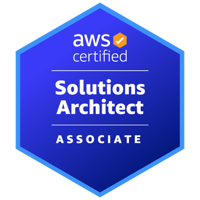
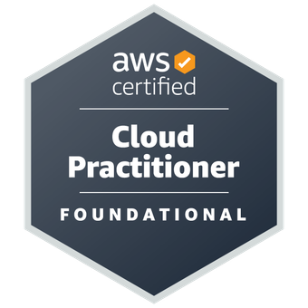
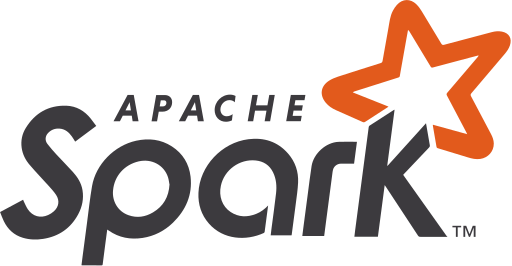

<!--  -->

# Hi there 👋

🔭 **Senior Data Engineer** with a proven track record in designing and deploying robust, scalable big data architectures on cloud platforms. Proficient in leveraging cloud computing technologies to automate data pipelines and extract valuable insights..

<!--
**elviejoguille/elviejoguille** is a ✨ _special_ ✨ repository because its `README.md` (this file) appears on your GitHub profile.

Here are some ideas to get you started:

- 🔭 I’m currently working on ...
- 🌱 I’m currently learning ...
- 👯 I’m looking to collaborate on ...
- 🤔 I’m looking for help with ...
- 💬 Ask me about ...
- 📫 How to reach me: ...
- 😄 Pronouns: ...
- ⚡ Fun fact: ...
-->

# 📫 How to Reach Me
- **Email**: [guillermo.cabrera@outlook.com](mailto:guillermo.cabrera@outlook.com)
- **LinkedIn**: [elviejoguille](https://www.linkedin.com/in/elviejoguille/)

# 🏆 Cloud Certificates

<!-- - AWS Certified Solutions Architect - Associate [🥇](https://www.credly.com/badges/291ab8fa-c852-4472-aab3-1a8baf858be0/linked_in_profile)
- AWS Cloud Practitiones [🥈](https://www.credly.com/badges/66d9f8f8-0b39-435d-a903-3f6af899b6eb/public_url) -->

# 👨‍🔬 Stack

 

# 🧠 Skills

## 💪 **Technical Skills**

- **Cloud Computing**: Proficient in AWS and exploring GCP for scalable data engineering solutions.
- **Data Engineering**: Experienced in designing and implementing robust data pipelines, ETL processes, and data warehousing solutions.
- **Big Data Technologies**: Proficient in handling large-scale data with technologies like Apache Spark, Hadoop.
- **Data Warehousing and Data Lakes**: Experienced in designing and implementing data warehouses and data lakes using technologies like AWS Redshift and S3.
- **Python Programming**: Strong Python programming skills for data analysis, machine learning, and automation.

 
## 🐼 **Soft Skills**
- **Leadership and Teamwork**: Strong leadership and teamwork skills, with experience in leading and collaborating with cross-functional teams.
- **Communication and Presentation**: Effective communication and presentation skills to convey technical concepts to both technical and non-technical audiences.
- **Problem-Solving and Critical Thinking**: Proven ability to analyze complex problems, identify root causes, and implement innovative solutions.
- **Continuous Learning**: Passionate about staying up-to-date with the latest trends and technologies in the data engineering field.

##  🗣️ **Language Skills**:
- English: Improving English language skills for effective communication and collaboration in global teams.

# 🌱 I’m currently learning
- 🚀 I'm learning how to become on MLops Engineer
- ☁️ Others clouds like GCP
- 🫂 Soft skills leading teams
- 🇺🇸 Improving my english

# 📈 Stats

<!-- ## 📈 Top Languages
 -->