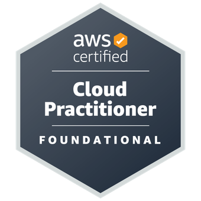

<!--  -->

# Hi there 👋

🔭 I’m currently working like Senior Data Engineer

<!--
**elviejoguille/elviejoguille** is a ✨ _special_ ✨ repository because its `README.md` (this file) appears on your GitHub profile.

Here are some ideas to get you started:

- 🔭 I’m currently working on ...
- 🌱 I’m currently learning ...
- 👯 I’m looking to collaborate on ...
- 🤔 I’m looking for help with ...
- 💬 Ask me about ...
- 📫 How to reach me: ...
- 😄 Pronouns: ...
- ⚡ Fun fact: ...
-->

# 🌱 I’m currently learning
- 🚀 I'm learning how to become on MLops Engineer
- ☁️ Others clouds like GCP
- 🫂 Soft skills leading teams
- 🇺🇸 Improving my english

## 📫 How to Reach Me
- **Email**: [guillermo.cabrera@outlook.com](mailto:guillermo.cabrera@outlook.com)
- **LinkedIn**: [elviejoguille](https://www.linkedin.com/in/elviejoguille/)

## 🏆 Cloud Certificates

<!-- - AWS Certified Solutions Architect - Associate [🥇](https://www.credly.com/badges/291ab8fa-c852-4472-aab3-1a8baf858be0/linked_in_profile)
- AWS Cloud Practitiones [🥈](https://www.credly.com/badges/66d9f8f8-0b39-435d-a903-3f6af899b6eb/public_url) -->

# Stack

# Skills
  
 - **ability to work effectively in a cross-functional team environment**

# Stats

<!-- ## 📈 Top Languages
 -->